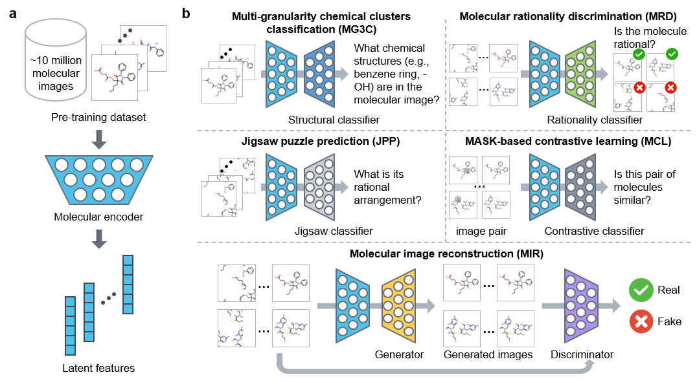

# ImageMol

The code is an official PyTorch-based implementation in the paper [Accurate prediction of molecular properties and drug targets using a self-supervised image representation learning framework](https://www.nature.com/articles/s42256-022-00557-6) (accepted in *Nature Machine Intelligence*, 2022).


<a href="https://zenodo.org/badge/latestdoi/516735012"></a>
[](https://www.oscs1024.com/project/HongxinXiang/ImageMol?ref=badge_small)
<a href="https://github.com/HongxinXiang/ImageMol/blob/master/LICENSE">
    
</a>


## Abstract

The clinical efficacy and safety of a drug is determined by its molecular properties and targets in humans. However, proteome-wide evaluation of all compounds in humans, or even animal models, is challenging. In this study, we present an unsupervised pretraining deep learning framework, named ImageMol, pretrained on 10 million unlabelled drug-like, bioactive molecules, to predict molecular targets of candidate compounds. The ImageMol framework is designed to pretrain chemical representations from unlabelled molecular images on the basis of local and global structural characteristics of molecules from pixels. We demonstrate high performance of ImageMol in evaluation of molecular properties (that is, the drug’s metabolism, brain penetration and toxicity) and molecular target profiles (that is, beta-secretase enzyme and kinases) across 51 benchmark datasets. ImageMol shows high accuracy in identifying anti-SARS-CoV-2 molecules across 13 high-throughput experimental datasets from the National Center for Advancing Translational Sciences. Via ImageMol, we identified candidate clinical 3C-like protease inhibitors for potential treatment of COVID-19.




## News!
**[2022/11/17]** ImageMol is [online](https://www.nature.com/articles/s42256-022-00557-6).

**[2022/10/07]** Accepted in *Nature Machine Intelligence*, 2022.

**[2022/09/17]** Upload more benchmark datasets, including multi-label CYP450, kinases and KinomeScan.

**[2022/07/28]** Repository installation completed.


## Install environment

#### 1. GPU environment
CUDA 10.1


#### 2. create a new conda environment

conda create -n imagemol python=3.7.3

conda activate imagemol


#### 3. download some packages 

conda install -c rdkit rdkit 

windows:

- pip install https://download.pytorch.org/whl/cu101/torch-1.4.0-cp37-cp37m-win_amd64.whl
- pip install https://download.pytorch.org/whl/cu101/torchvision-0.5.0-cp37-cp37m-win_amd64.whl

linux:
- pip install https://download.pytorch.org/whl/cu101/torch-1.4.0-cp37-cp37m-linux_x86_64.whl
- pip install https://download.pytorch.org/whl/cu101/torchvision-0.5.0-cp37-cp37m-linux_x86_64.whl

pip install torch-cluster torch-scatter torch-sparse torch-spline-conv -f https://pytorch-geometric.com/whl/torch-1.4.0%2Bcu101.html

pip install -r requirements.txt

source activate imagemol


## Pretraining

#### 1. preparing dataset

Download [pretraining data](https://drive.google.com/file/d/1t1Ws-wPYPeeuc8f_SGgnfUCVCzlM_jUJ/view?usp=sharing) and put it into ``./datasets/pretraining/data/``

Preprocess dataset:

```bash
python ./data_process/smiles2img_pretrain.py --dataroot ./datasets/pretraining/ --dataset data
```

**Note:** You can find the toy dataset in ``./datasets/toy/pretraining/``

#### 2. start to pretrain

Usage:

```bash
usage: pretrain.py [-h] [--lr LR] [--wd WD] [--workers WORKERS]
                   [--val_workers VAL_WORKERS] [--epochs EPOCHS]
                   [--start_epoch START_EPOCH] [--batch BATCH]
                   [--momentum MOMENTUM] [--checkpoints CHECKPOINTS]
                   [--seed SEED] [--dataroot DATAROOT] [--dataset DATASET]
                   [--ckpt_dir CKPT_DIR] [--modelname {ResNet18}]
                   [--verbose] [--ngpu NGPU] [--gpu GPU] [--nc NC] [--ndf NDF]
                   [--imageSize IMAGESIZE] [--Jigsaw_lambda JIGSAW_LAMBDA]
                   [--cluster_lambda CLUSTER_LAMBDA]
                   [--constractive_lambda CONSTRACTIVE_LAMBDA]
                   [--matcher_lambda MATCHER_LAMBDA]
                   [--is_recover_training IS_RECOVER_TRAINING]
                   [--cl_mask_type {random_mask,rectangle_mask,mix_mask}]
                   [--cl_mask_shape_h CL_MASK_SHAPE_H]
                   [--cl_mask_shape_w CL_MASK_SHAPE_W]
                   [--cl_mask_ratio CL_MASK_RATIO]
```

Code to pretrain:

```bash
python pretrain.py --ckpt_dir ./ckpts/pretraining/ \
                   --checkpoints 1 \
                   --Jigsaw_lambda 1 \
                   --cluster_lambda 1 \
                   --constractive_lambda 1 \
                   --matcher_lambda 1 \
                   --is_recover_training 1 \
                   --batch 256 \
                   --dataroot ./datasets/pretraining/ \
                   --dataset data \
                   --gpu 0,1,2,3 \
                   --ngpu 4
```

For testing, you can simply pre-train ImageMol using single GPU on toy dataset:

```bash
python pretrain.py --ckpt_dir ./ckpts/pretraining-toy/ \
                   --checkpoints 1 \
                   --Jigsaw_lambda 1 \
                   --cluster_lambda 1 \
                   --constractive_lambda 1 \
                   --matcher_lambda 1 \
                   --is_recover_training 1 \
                   --batch 16 \
                   --dataroot ./datasets/toy/pretraining/ \
                   --dataset data \
                   --gpu 0 \
                   --ngpu 1
```


## Finetuning

#### 1. Download pre-trained ImageMol

You can download [pre-trained model](https://drive.google.com/file/d/1wQfby8JIhgo3DxPvFeHXPc14wS-b4KB5/view?usp=sharing) and push it into the folder ``ckpts/``


#### 2. Finetune with pre-trained ImageMol

**a)** You can download [molecular property prediciton datasets](https://drive.google.com/file/d/1IdW6J6tX4j5JU0bFcQcuOBVwGNdX7pZp/view?usp=sharing), [CYP450 datasets](https://drive.google.com/file/d/1mBsgGWXYqej5McsLwy1_fs_-VGGQnCro/view?usp=sharing), [multi-label CYP450 dataset](https://drive.google.com/file/d/1VVV5HjIUwlm1yYjksz-e37LUPh-iuB4y/view?usp=sharing), [SARS-CoV-2 datasets](https://drive.google.com/file/d/1UfROoqR_aU6f5xWwxpLoiJnkwyUzDsui/view?usp=sharing), [kinases datasets](https://drive.google.com/file/d/1HVHrxJfW16-5uxQ-7DxgQTxroXxeFDcQ/view?usp=sharing) and [KinomeScan datasets](https://drive.google.com/file/d/1V4xVgjbzBWcIu0CRcHoYVZH9jdnZXpPj/view?usp=sharing) and put it into ``datasets/finetuning/``

**b)** The usage is as follows:

```bash
usage: finetune.py [-h] [--dataset DATASET] [--dataroot DATAROOT] [--gpu GPU]
                   [--workers WORKERS] [--lr LR] [--weight_decay WEIGHT_DECAY]
                   [--momentum MOMENTUM] [--seed SEED] [--runseed RUNSEED]
                   [--split {random,stratified,scaffold,random_scaffold,scaffold_balanced}]
                   [--epochs EPOCHS] [--start_epoch START_EPOCH]
                   [--batch BATCH] [--resume PATH] [--imageSize IMAGESIZE]
                   [--image_model IMAGE_MODEL] [--image_aug] [--weighted_CE]
                   [--task_type {classification,regression}]
                   [--save_finetune_ckpt {0,1}] [--log_dir LOG_DIR]
```

**c)** You can run ImageMol by simply using the following code:

```bash
python finetune.py --gpu ${gpu_no} \
                   --save_finetune_ckpt ${save_finetune_ckpt} \
                   --log_dir ${log_dir} \
                   --dataroot ${dataroot} \
                   --dataset ${dataset} \
                   --task_type ${task_type} \
                   --resume ${resume} \
                   --image_aug \
                   --lr ${lr} \
                   --batch ${batch} \
                   --epochs ${epoch}
```

For example:

```bash
python finetune.py --gpu 0 \
                   --save_finetune_ckpt 1 \
                   --log_dir ./logs/toxcast \
                   --dataroot ./datasets/finetuning/benchmarks \
                   --dataset toxcast \
                   --task_type classification \
                   --resume ./ckpts/ImageMol.pth.tar \
                   --image_aug \
                   --lr 0.5 \
                   --batch 64 \
                   --epochs 20
```

**Note:** You can tune more hyper-parameters during fine-tuning (see **b) Usage**).


## Finetuned models

To ensure the reproducibility of ImageMol, we provided finetuned models for eight datasets, including: 

- [BBBP](https://drive.google.com/file/d/1eaWZ9sAuqfQiGPMsfIpRV5zk3udCcNk_/view?usp=sharing)

- [Tox21](https://drive.google.com/file/d/10X9-2rpxzvHjsvTI68fC11ojEZ7ErnIt/view?usp=sharing)

- [ClinTox](https://drive.google.com/file/d/18otgDJERE66e3F_bltvNHi8jQR6eb3R6/view?usp=sharing)

- [HIV](https://drive.google.com/file/d/1NOj3Hr36bbn6POdcFBciCbb5ilVz2440/view?usp=sharing)

- [BACE](https://drive.google.com/file/d/1q9-QCGbaACzw-QO2pOrK-FrGMr1yz1L0/view?usp=sharing)

- [SIDER](https://drive.google.com/file/d/1-SNdFCI0WyKCGbyD8wocffmzSd6rw5Qt/view?usp=sharing)

- [MUV](https://drive.google.com/file/d/150JCurBZgtd2O3KcQ4-AFAZowIKSOwLF/view?usp=sharing)

- [ToxCast](https://drive.google.com/file/d/148MJd5vsV_Q3sErJtRAe12VFDEmBGC05/view?usp=sharing)

You can evaluate the finetuned model by using the following command:

```bash
python evaluate.py --dataroot ${dataroot} \
                   --dataset ${dataset} \
                   --task_type ${task_type} \
                   --resume ${resume} \
                   --batch ${batch}
```

For example:

```bash
python evaluate.py --dataroot ./datasets/finetuning/benchmarks \
                   --dataset toxcast \
                   --task_type classification \
                   --resume ./toxcast.pth \
                   --batch 128
```


## GradCAM Visualization

More about GradCAM heatmap can be found from this link: https://drive.google.com/file/d/1uu3Q6WLz8bJqcDaHEG84o3mFvemHoA2v/view?usp=sharing

To facilitate observation of high-confidence regions in the GradCAM heatmap, we use a confidence to filter out lower-confidence regions, which can be found from this link: https://drive.google.com/file/d/1631kSSiM_FSRBBkfh7PwI5p3LGqYYpMc/view?usp=sharing

### run script

We also provide a script to generate GradCAM heatmaps:

```bash
usage: main.py [-h] [--image_model IMAGE_MODEL] --resume PATH --img_path
               IMG_PATH --gradcam_save_path GRADCAM_SAVE_PATH
               [--thresh THRESH]
```

you can run the following script:

```bash
python main.py --resume ${resume} \
               --img_path ${img_path} \
               --gradcam_save_path ${gradcam_save_path} \
               --thresh ${thresh}
```


## Process your own dataset

If you want to process your own dataset and obtain molecular images, use the following steps:

1. Preprocessing smiles: Please use the method `preprocess_list(smiles)` of [this link](https://github.com/jrwnter/cddd/blob/master/cddd/preprocessing.py) to process your raw SMILES data;
2. Transforming smiles to image: Convert canonical smiles to molecular images using `dataloader.image_dataloader.Smiles2Img(smis, size=224, savePath=None)`


# Reference
If you use ImageMol in scholary publications, presentations or to communicate with your satellite, please cite the following work that presents the algorithms used:
```bib
@article{zeng2022accurate,
  title={Accurate prediction of molecular properties and drug targets using a self-supervised image representation learning framework},
  author={Zeng, Xiangxiang and Xiang, Hongxin and Yu, Linhui and Wang, Jianmin and Li, Kenli and Nussinov, Ruth and Cheng, Feixiong},
  journal={Nature Machine Intelligence},
  volume={4},
  number={11},
  pages={1004--1016},
  year={2022},
  publisher={Nature Publishing Group}
}
```

If you additionally want to cite this code package, please cite as follows:
```bib
@software{hongxinxiang_2022_7088986,
  author       = {HongxinXiang},
  title        = {HongxinXiang/ImageMol: v1.0.0},
  month        = sep,
  year         = 2022,
  publisher    = {Zenodo},
  version      = {v1.0.0},
  doi          = {10.5281/zenodo.7088986},
  url          = {https://doi.org/10.5281/zenodo.7088986}
}
```